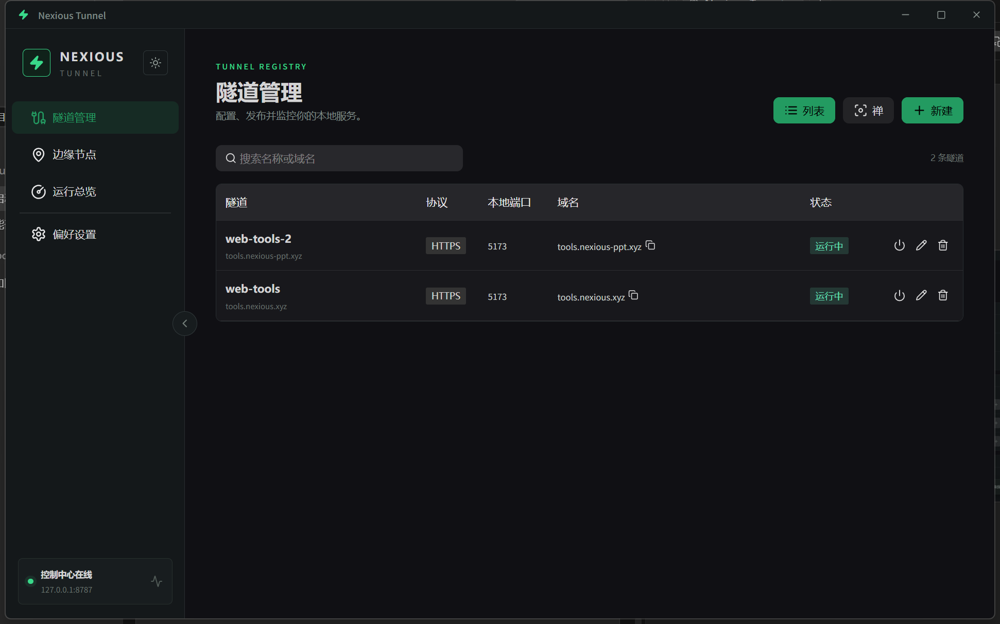
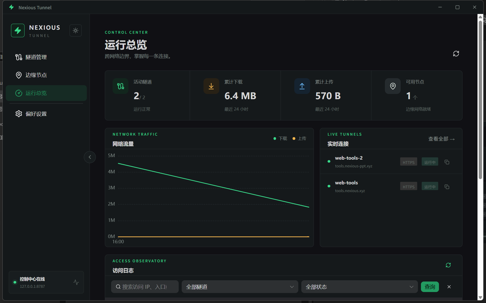
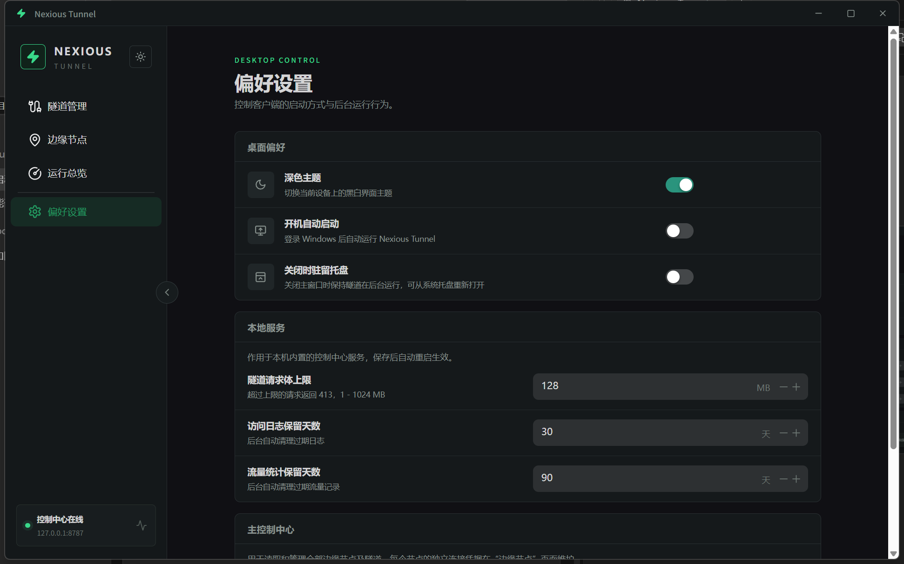

# Nexious Tunnel

轻量级内网穿透工作台：一个 Windows 桌面客户端，管理你的全部边缘节点与隧道，把本地服务一键发布到公网。

Tauri 2 + Vue 3 桌面端 · Express 控制中心 · WebSocket 中继 · 边缘节点自动部署

## 应用截图

| 隧道管理 | 运行总览 |
| --- | --- |
|  |  |



## 功能特性

- **隧道管理**：将本地 HTTP/HTTPS 服务发布为 `子域名.节点域名` 的公网地址，列表 / 禅两种视图，支持搜索、运行状态切换、Token 重新生成。
- **边缘节点自动部署**：填入 `用户名@服务器` 与 SSH 密码即可一键部署独立节点控制器——自动安装 Node.js 20（已有环境自动跳过）、上传源码、注册 systemd 服务、探测既有反向代理或安装 Caddy 自动签发 HTTPS 证书（失败自动回退并提示）。
- **公网访问零改动**：HTTP 与 WebSocket 全代理，自动清理 hop-by-hop 头、归一化 Cookie Domain、改写跨域标识，本地应用不需要任何改造即可被公网访问。
- **运行总览**：24 小时流量曲线（聚合全部节点）、实时隧道列表、访问日志检索与状态过滤。
- **桌面集成**：开机自启、关闭驻留托盘、单实例保护、深浅主题、控制中心健康状态指示、启动页无白屏。
- **安全设计**：本地控制中心随机管理 Token（不内置固定口令）、节点全链路 HTTPS、隧道请求体上限、访问日志与流量自动清理、防伪造代理头。

## 架构

```
浏览器 ──► Cloudflare / nginx（可选 TLS）──► 节点控制器 :8788
                                              │ WebSocket relay
                                              ▼
                                   Nexious Tunnel 桌面端 agent ──► 127.0.0.1:本地服务
```

| 目录 | 说明 |
| --- | --- |
| `apps/desktop` | Tauri 2 桌面端：Vue 3 + naive-ui 界面；Rust 侧内置并发隧道 agent、本地控制中心生命周期管理、单实例保护 |
| `apps/server` | 控制中心 / 节点控制器（同一份代码，`NEXIOUS_NODE_CONTROLLER=1` 切换角色）：REST API、WS 中继、隧道对账、日志与流量统计 |
| `apps/agent` | 独立 Node agent，可部署在任意机器上连接 relay 转发本地服务 |
| `scripts/` | 桌面运行时打包脚本（node.exe + server 产物 + 依赖） |
| `.github/workflows/ci.yml` | CI：server/agent/desktop 类型检查、构建、测试与 cargo test |

## 快速开始

环境要求：Node.js 20+、pnpm 9、Rust stable（`x86_64-pc-windows-msvc`）、WebView2 Runtime（Win11 自带）。

```bash
pnpm install

pnpm dev            # 主控 API + 前端（浏览器预览）
pnpm dev:desktop    # 桌面端开发模式（Tauri dev）
pnpm build          # 构建全部子包
pnpm typecheck      # 全量类型检查
```

打包桌面应用（exe + NSIS / MSI 安装程序）：

```bash
pnpm --filter @nexious/desktop tauri build
# 产物位于 apps/desktop/src-tauri/target/release/bundle/
```

## 测试

```bash
cargo test --manifest-path apps/desktop/src-tauri/Cargo.toml
pnpm --filter @nexious/server test
```

## 使用指南

1. **添加边缘节点**：在“边缘节点”页添加节点基础域名（如 `nexious.xyz`，需解析到你的服务器，可经 Cloudflare 代理），填入 SSH 连接执行一键部署。
2. **新建隧道**：在“隧道管理”页选择节点、填写本地地址与子域名，启动后即可通过 `https://子域名.节点域名` 访问。
3. **偏好设置**：可调整请求体上限、日志/流量保留天数（保存后自动重启本地服务生效）；支持切换为远程主控制中心地址。
