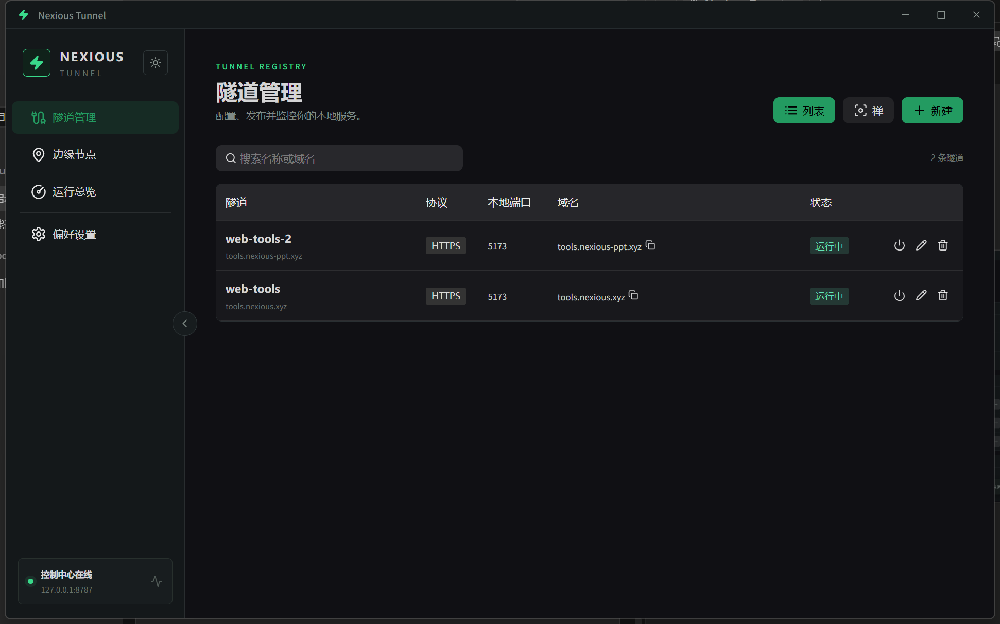
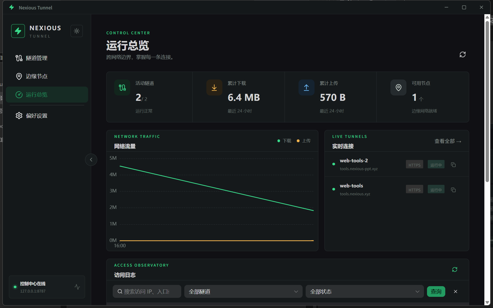
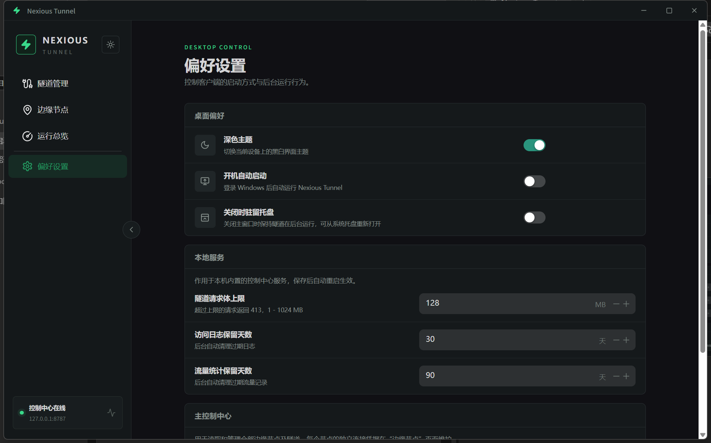

# Nexious Tunnel

轻量级内网穿透工作台：一个 Windows 桌面客户端，管理你的全部边缘节点与隧道，把本地服务一键发布到公网。

Tauri 2 + Vue 3 桌面端 · Express 控制中心 · WebSocket 中继 · 边缘节点自动部署

## 应用截图

| 隧道管理 | 运行总览 |
| --- | --- |
|  |  |



## 功能特性

- **隧道管理**：将本地 HTTP/HTTPS 服务发布为 `子域名.节点域名` 的公网地址，列表 / 禅两种视图，支持搜索、运行状态切换、Token 重新生成。
- **边缘节点自动部署**：填入 `用户名@服务器` 与 SSH 密码即可一键部署独立节点控制器——检查 Linux/systemd、Node.js、依赖和端口，复用可用节点令牌与隧道数据，分阶段安装并通过 API/WebSocket 验证后切换；启动、认证、数据库或入口验证失败会自动恢复旧版本。已有反向代理会保留，只有空闲服务器才会按需配置 Caddy HTTPS；Cloudflare 仍只负责域名代理。
- **公网访问零改动**：HTTP 与 WebSocket 全代理，自动清理 hop-by-hop 头、归一化 Cookie Domain、改写跨域标识，本地应用不需要任何改造即可被公网访问。
- **运行总览**：24 小时流量曲线（聚合全部节点）、实时隧道列表、访问日志检索与状态过滤。
- **桌面集成**：开机自启、关闭驻留托盘、单实例保护、深浅主题、启动页无白屏。
- **账号安全**：账号密码至少 8 位，注册使用 Resend 邮箱验证码，登录弹出服务端生成的文字点选行为验证。本机和远程主控均使用个人账号登录，边缘节点不开放账号登录或注册。
- **服务器重置**：管理员通过服务器 SSH 密码与行为验证确认，停止并备份后清除 Nexious 节点服务、配置与节点数据，保留其他网站和服务；主控中的隧道定义保留并停止。
- **会员与邀请**：管理员配置套餐价格、天数和配额，手动开通与续期；支持邀请活动及奖励次数限制，受邀账号完成邮箱验证后自动发放永久隧道配额奖励。套餐到期回落至默认配额，账号自定义配额优先，奖励叠加后最多 10000 条。
- **安全设计**：本地控制中心随机管理 Token（不内置固定口令）、节点全链路 HTTPS、隧道请求体上限、访问日志与流量自动清理、防伪造代理头。

## 架构

```
浏览器 ──► Cloudflare / nginx（可选 TLS）──► 节点控制器 :8788
                                              │ WebSocket relay
                                              ▼
                                   Nexious Tunnel 桌面端 agent ──► 127.0.0.1:本地服务
```

| 目录 | 说明 |
| --- | --- |
| `apps/desktop` | Tauri 2 桌面端：Vue 3 + naive-ui 界面；Rust 侧内置并发隧道 agent、本地控制中心生命周期管理、单实例保护 |
| `apps/server` | 控制中心 / 节点控制器（同一份代码，`NEXIOUS_NODE_CONTROLLER=1` 切换角色）：REST API、WS 中继、隧道对账、日志与流量统计 |
| `apps/agent` | 独立 Node agent，可部署在任意机器上连接 relay 转发本地服务 |
| `scripts/` | 桌面运行时打包脚本（node.exe + server 产物 + 依赖） |
| `.github/workflows/ci.yml` | CI：server/agent/desktop 类型检查、构建、测试与 cargo test |

桌面 Agent 对已配置 HTTPS 的节点优先尝试直连服务器 IP，TLS 仍使用节点基础域名校验证书。源站必须提供覆盖该域名的受信任证书；连接或 TLS 校验失败时，自动回退到配置的中继入口。浏览器访问仍可保留 Cloudflare 橙云代理。直连不需要修改 DNS，适用于控制中心域名位于节点基础域名下、且服务器地址为 IP 的节点。

主控的健康检查、隧道同步、日志和统计请求也优先使用相同的加密直连条件，并复用 HTTPS 连接。直连握手失败时回退到已配置的控制器地址，30 秒后再尝试直连；已发送的写请求发生网络错误时不会自动重放。直连与回退共用请求超时预算。

部署反向代理时，可为指定应用的带内容哈希的 JS/CSS/字体资源设置长期缓存，例如 `public, max-age=31536000, immutable`。仅对匿名、成功且类型匹配的静态响应应用此策略，保留上游 `private`、`no-store` 和 `no-cache` 限制。首页、登录、上传和 API 响应保持原有缓存策略；发布新版本时通过资源文件名的哈希更新缓存。

## 快速开始

环境要求：Node.js 22.13+（推荐 24）、MySQL 8.0+（主控）、pnpm 9、Rust stable（`x86_64-pc-windows-msvc`）、WebView2 Runtime（Win11 自带）。主控业务数据统一使用 MySQL，边缘节点继续使用 SQLite。

```bash
pnpm install

pnpm dev            # 主控 API + 前端（浏览器预览）
pnpm dev:desktop    # 桌面端开发模式（Tauri dev）
pnpm build          # 构建全部子包
pnpm typecheck      # 全量类型检查
```

打包桌面应用（exe + NSIS / MSI 安装程序）：

```bash
pnpm --filter @nexious/desktop tauri build
# 产物位于 apps/desktop/src-tauri/target/release/bundle/
```

## 测试

```bash
cargo test --manifest-path apps/desktop/src-tauri/Cargo.toml
pnpm --filter @nexious/server test
```

## 使用指南

1. **添加边缘节点**：在“边缘节点”页添加节点基础域名（如 `nexious.xyz`，需解析到你的服务器，可经 Cloudflare 代理），填入 SSH 连接执行一键部署。部署窗口可以关闭，任务会在服务端继续运行；重新打开后可恢复查看进度。
2. **新建隧道**：在“隧道管理”页选择节点、填写本地地址与子域名，启动后即可通过 `https://子域名.节点域名` 访问。
3. **偏好设置**：可调整日志/流量保留天数（保存后自动重启本地服务生效）。请求体上限由服务端作为内存保护固定启用，不对外开放；自建主控可通过 `NEXIOUS_MAX_BODY_MB` 调整。

账号注册统一使用邮箱验证，无需“开放自助注册”开关。将 `RESEND_API_KEY`、`RESEND_FROM`、可选的 `RESEND_REPLY_TO` 与 `RESEND_API_URL=https://api.resend.com` 放入主控的私有环境配置，发件域名需在 Resend 完成验证。开发主控使用 `apps/server/.env`；Windows 内置主控使用 `%APPDATA%/com.nexious.tunnel/local-api.env`，修改后重启应用。密钥不需要配置到边缘节点。

会员套餐当前由管理员开通，未接入在线支付。已有账号可在“会员与邀请”绑定邮箱后分享邀请码；朋友注册时填写该码即可参与当前有效的活动。

## 数据存储与历史迁移

主控的账号、会话、节点、隧道、套餐、邀请活动、验证记录、审计、日志、流量与业务设置均存入 MySQL。开发主控在 `apps/server/.env` 配置 `NEXIOUS_DB_DRIVER=mysql` 与 `NEXIOUS_MYSQL_*`，示例见 `apps/server/.env.example`。Windows 桌面内置主控在 `%APPDATA%/com.nexious.tunnel/local-api.env` 使用相同配置，重启后生效；数据库凭据不能打包进客户端资源或提交到仓库。数据库用户仅需主控专用库的读写、建表、建索引及修改表结构权限。

边缘节点设置 `NEXIOUS_NODE_CONTROLLER=1`、`NEXIOUS_DB_DRIVER=sqlite`，继续将本节点运行数据保存在 `/var/lib/nexious-node/nexious.db`。桌面偏好与加密登录凭据仍由当前设备保存；数据库迁移不会替代 Windows 安全凭据存储。

迁移前停止旧 SQLite 主控，备份源库及目标 MySQL，再执行：

```bash
# 预览合并结果，业务写入会回滚（表结构会按需初始化）。
pnpm --filter @nexious/server migrate:sqlite /path/to/nexious.db --merge --dry-run
# 正式合并，已有 MySQL 记录保持不变。
pnpm --filter @nexious/server migrate:sqlite /path/to/nexious.db --merge
```

迁移保留账号密码、有效会话与隧道归属，重名账号添加 `_local` 后缀（再次冲突则为 `_local2` 等）。缺少归属的历史隧道归入导入库中的启用管理员。整个导入使用事务，约束冲突会回滚；相同源文件与快照的重复导入不会新增记录。迁移后保留源 SQLite 作为存档，主控不再读写它；如果源库仍被旧服务修改，迁移命令会拒绝再次导入。

```bash
pnpm --filter @nexious/server test:mysql
```

MySQL 集成测试使用 `apps/server/.env.test` 配置的独立 `*_test` 数据库，会清理该测试库；禁止指向业务库。
